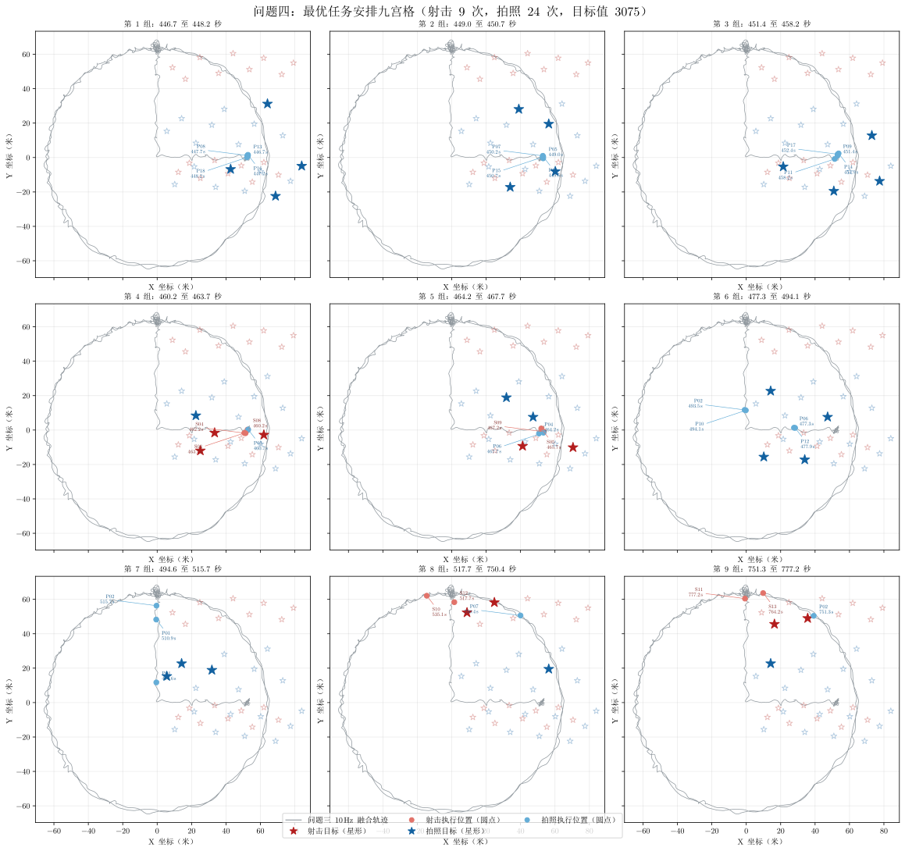
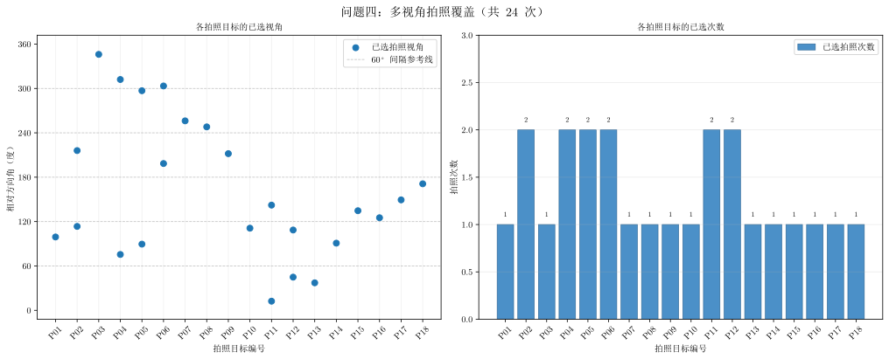

# 问题四主体结论

## 图片



图片文件：`outputs/four/problem_four_schedule.svg`



图片文件：`outputs/four/problem_four_photo_views.svg`

## 图意

1. **任务安排图**

完整方案按实际执行时刻均匀拆为 9 组，放在同一张 `3×3` 九宫格图中；每格只高亮连续的 3 至 4 个任务，因此密集区域也可以辨认。每格都保留完整轨迹和淡化的全部目标，并在本组每个执行位置旁标出“目标编号 + 执行时间”。两类目标均使用星形，实际执行位置均使用圆点；空心星表示未选目标，实心星表示本组已选目标。**深红星/浅红点**依次表示射击目标及其执行位置，**深蓝星/浅蓝点**依次表示拍照目标及其执行位置。

图中数字、坐标轴刻度以及坐标轴中的拉丁字母 `X`、`Y` 使用 Latin Modern Math；坐标轴和图例中的中文使用宋体。这样可以避免英文字母被中文字体替代。

2. **多视角拍照图**

左图给出每个拍照目标的已选方向角；灰色虚线以 $60^\circ$ 为间隔，便于检查视角分散情况。右图统计每个拍照目标被选择的次数，未被拍照的目标仍保留在横轴上。

## 模型与结果

首先根据距离、速度、加速度和准备时长筛选候选任务。对每个候选任务设置一个 0--1 决策变量；时间准备区间重叠的候选、同一拍照目标中视角差小于 $60^\circ$ 的候选，均不能同时选取；同一射击目标最多射击一次。

目标函数为：

$$
\max K=75N_{\mathrm{shoot}}+100N_{\mathrm{photo}}.
$$

当前数据和约束下，整数规划器得到最优解：**射击 9 次、拍照 24 次，共 33 项任务，目标值为 3075**，即

$$
K=75\times9+100\times24=3075.
$$

两张图由 `solvers/four/visual.py` 直接调用当前求解器生成，因此会随候选任务或约束参数的改变自动更新。

标准 41 点方案的已选任务同时导出为 `outputs/four/result.csv`。每一行对应一个已选任务，包含候选编号、任务类型、目标编号、准备开始时刻、执行时刻、拍照角度以及机器人执行坐标。

## 结论

该方案在满足准备时间冲突、拍照角度差和“每个射击目标至多一次”约束的前提下，取得当前权重下的最大任务收益。拍照任务优先级更高，因此最优解在不破坏时序可行性的范围内安排了更多拍照，并对部分拍照目标选择了多个相互分离的视角。

## 复现

```powershell
python -m solvers.four.visual
python -m solvers.four.dump
```

其中，`solvers.four.dump` 会重新求解标准方案并将结果写入 `outputs/four/result.csv`。
