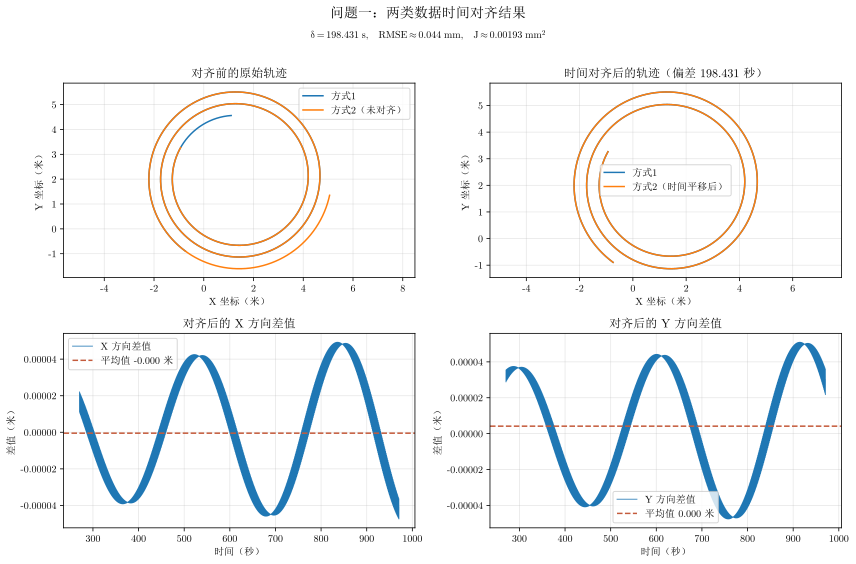

# 问题一主体结论

## 图片

图片文件：`outputs/one/problem_one_conclusion.svg`

## 各子图含义

1. **左上：对齐前的原始轨迹**

   蓝线和橙线分别表示方式 1、方式 2 的轨迹。两条曲线形状相似但起始位置不同，说明两类数据存在时间错位。

2. **右上：时间对齐后的轨迹**

   将方式 2 的时间平移后，两条轨迹基本重合。估计时间偏差为
   $\delta=198.431\ \mathrm{s}$。

3. **左下：X 方向差值**

   绘制
   $$
   d_x(t)=x_2(t+\delta)-x_1(t)
   $$
   差值在零附近小幅波动，没有明显的时间趋势。

4. **右下：Y 方向差值**

   绘制
   $$
   d_y(t)=y_2(t+\delta)-y_1(t)
   $$
   差值同样很小且没有明显漂移，说明时间对齐效果稳定。

## 结论

两类数据的时间偏差约为 **198.431 秒**。对齐后位置残差 RMSE 约为 **0.044 毫米**，目标函数约为 **0.00193 平方毫米**，说明两条轨迹在时间上已经很好地对齐。问题一的主要任务是估计时间偏差，因此后续可采用该偏差生成 10 Hz 对齐轨迹。