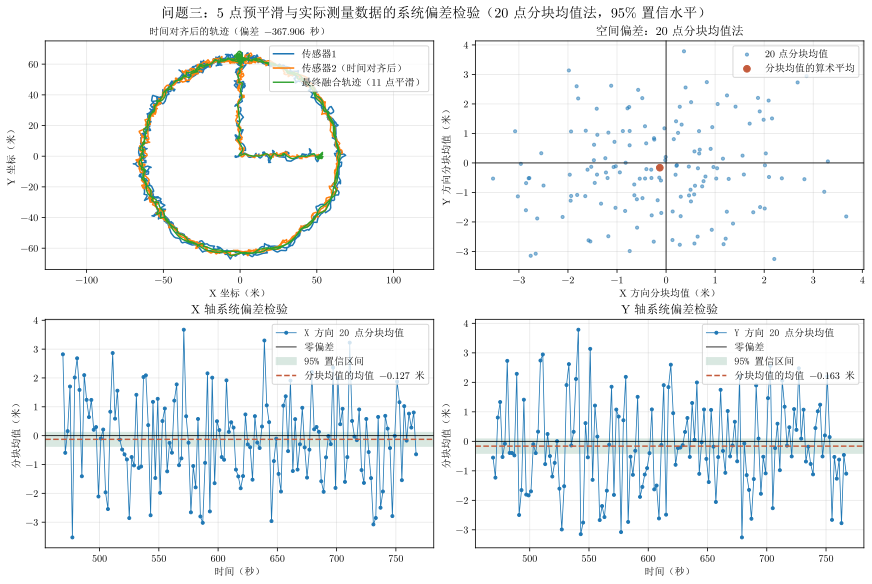

# 问题三主体结论

## 图片

图片文件：`outputs/three/problem_three_conclusion.svg`

图中坐标轴、标题和图例中的负数均以 LaTeX 数学模式排版，使用数学负号而非普通连字符。

## 各子图含义

1. **左上：时间对齐后的实际测量轨迹**

   两类实际测量数据按估计时间偏差对齐。时间偏差约为
   $\delta=-367.906\ \mathrm{s}$。

2. **右上：20 点分块均值的空间偏差散点**

   使用实际求解器的时间对齐与线性插值结果，将逐点差值按 20 个采样点分块。每个散点是一个分块的 X、Y 算术平均差值；高亮点是所有分块均值的算术平均，即固定空间偏差的点估计，约为
   $(-0.127,-0.163)\ \mathrm{m}$。

3. **左下：X 轴系统偏差检验**

   每个点是一个 20 点分块的 X 方向平均差值，绿色阴影表示以分块均值为样本计算的 95% 置信区间。区间约为
   $[-0.368,0.113]\ \mathrm{m}$，包含 0。

4. **右下：Y 轴系统偏差检验**

   每个点是一个 20 点分块的 Y 方向平均差值。95% 置信区间约为
   $[-0.406,0.081]\ \mathrm{m}$，同样包含 0。

## 偏差估计口径

记第 $k$ 个分块的 X、Y 平均差值为 $\bar d_{x,k}$、$\bar d_{y,k}$，共有 $m=150$ 个完整分块。求解器和主体图都以分块均值的算术平均作为固定偏差估计：

$$
\hat b_x=\frac{1}{m}\sum_{k=1}^{m}\bar d_{x,k},\qquad
\hat b_y=\frac{1}{m}\sum_{k=1}^{m}\bar d_{y,k}
$$

对每个方向，以分块均值的样本标准差 $s$ 计算标准误 $s/\sqrt m$，并采用正态近似的 $95\%$ 区间：

$$
\hat b\mathbin{\pm}1.96\frac{s}{\sqrt m}
$$

因此，图中的高亮点、橙色均值线、绿色区间，以及 `check_have_error` 的显著性判断均使用同一套“分块均值的算术平均”口径；没有使用中位数估计。

## 结论

两个传感器坐标先做 **5 点预平滑**，随后完成时间对齐、分块系统偏差检验和融合。X、Y 两个方向的 95% 置信区间都包含 0，因此没有足够证据认为实际测量数据存在显著固定系统偏差。虽然分块均值的算术平均略偏向负方向，但更合理的解释是随机误差造成的波动。后续融合不施加固定空间校正；得到的 10 Hz 融合轨迹再做 **11 点居中滑动平均**，以抑制高频随机波动。
