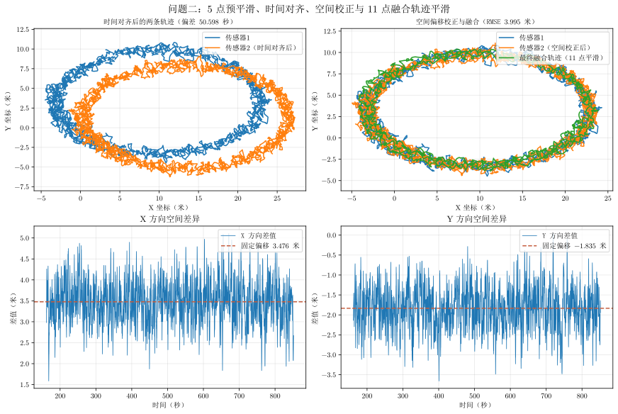

# 问题二主体结论

## 图片

图片文件：`outputs/two/problem_two_conclusion.svg`

## 各子图含义

1. **左上：时间对齐后的两条轨迹**

   将两台设备的时间统一后绘制轨迹。估计时间偏差为
   $\delta=50.472\ \mathrm{s}$，两条轨迹的运动过程基本对应。

2. **右上：空间偏移校正与轨迹融合**

   先计算两条对齐轨迹的平均空间差值，再从传感器 2 中减去该固定偏移，最后逐时刻取两台设备位置的平均值作为融合轨迹。校正后轨迹更加重合，融合 RMSE 约为 **4.151 米**。

3. **左下：X 方向空间差异**

   显示
   $$
   d_x(t)=x_2(t+\delta)-x_1(t)
   $$
   红色虚线是平均差值，约为 **3.475 米**，可视为 X 方向固定系统偏移。

4. **右下：Y 方向空间差异**

   显示
   $$
   d_y(t)=y_2(t+\delta)-y_1(t)
   $$
   平均差值约为 **-1.834 米**，可视为 Y 方向固定系统偏移。

## 结论

问题二同时存在时间偏差和固定空间偏移。应先进行约 **50.472 秒**的时间对齐，再校正空间偏移
$(3.475,-1.834)\ \mathrm{m}$，最后对两台设备的位置取平均，得到融合轨迹。该处理可以消除主要固定误差，但融合结果仍保留随机测量波动。
