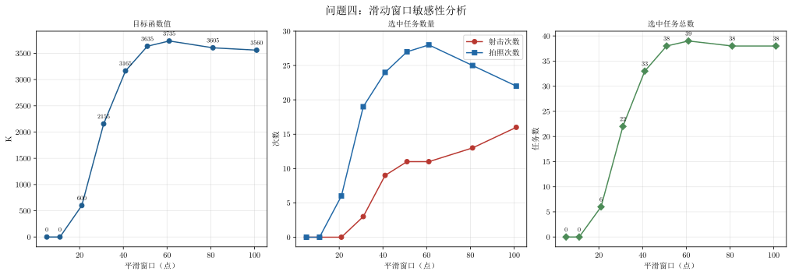

# 问题四敏感性分析

## 1. 分析目的

问题四根据问题三得到的 `10 Hz` 融合轨迹，安排射击和拍照任务。当前方案使用 41 点局部三次拟合估计轨迹速度和加速度，再筛选可行任务。敏感性分析考察：改变局部拟合窗口后，候选任务数量和整数规划最优解是否发生明显变化。

如果在合理窗口范围内最优目标值和任务数量变化很小，说明方案对平滑参数稳健；如果变化明显，则需要报告窗口选择对调度结果的影响，并选择目标值较高且运动估计合理的窗口。

本分析使用问题三的融合结果：

```text
outputs/three/result.csv
```

## 2. 问题四计算流程

### 2.1 轨迹和导数估计

问题三的 `result.csv` 已经是 10 Hz、11 点输出平滑后的融合位置。问题四保持这些位置不变，只改变局部拟合窗口 $w$，用三次多项式拟合相邻轨迹点，计算速度和加速度：

$$
x(t+u)\approx a_0+a_1u+a_2u^2+a_3u^3,
$$

$$
v_x(t)=a_1,\qquad a_x(t)=2a_2,
$$

$Y$ 方向同理。窗口越大，导数估计越平滑；窗口过小则容易放大残余噪声。窗口必须是大于等于 5 的奇数，多项式阶数固定为 3。

### 2.2 可行候选任务

对每个射击目标和拍照目标，遍历轨迹中的开始时刻 $T$。若准备区间

$$
[T,T+\tau]
$$

内的所有轨迹点都满足距离、速度和加速度约束，则把区间终点 $T+\tau$ 作为实际执行时刻，生成一个候选任务。射击准备时间为 1.5 s，拍照准备时间为 0.5 s。

### 2.3 0--1 整数规划

每个候选任务对应一个 0--1 变量 $z_i$。时间准备区间重叠的两个候选不能同时选择；同一拍照目标的两个候选若方向角差小于 $60^\circ$，也不能同时选择；同一射击目标最多选择一次。

目标函数为：

$$
\max K=75N_{\mathrm{shoot}}+100N_{\mathrm{photo}}.
$$

因此，改变窗口会先改变速度和加速度，再改变可行候选集合及其冲突关系，最后影响最优任务安排。

## 3. 敏感性因素和实验设置

本实验只改变局部拟合窗口，测试：

```text
5、11、21、31、41、51、61、81、101 点
```

对于每个窗口，均完整执行“导数估计—候选任务筛选—时间冲突和角度冲突构造—0--1 整数规划求解”。问题三的 `11` 点位置输出平滑不随本实验改变。求解器默认窗口仍为 41 点，因此本实验不会覆盖正式输出。

## 4. 结果

| 平滑窗口（点） | 射击次数 | 拍照次数 | 任务总数 | 目标值 $K$ |
| ---------------: | -------: | -------: | -------: | ---------: |
|                5 |        0 |        0 |        0 |          0 |
|               11 |        0 |        0 |        0 |          0 |
|               21 |        0 |        6 |        6 |        600 |
|               31 |        3 |       19 |       22 |       2125 |
|               41 |        9 |       24 |       33 |       3075 |
|               51 |       11 |       27 |       38 |       3525 |
|               61 |       11 |       28 |       39 |       3625 |
|               81 |       13 |       25 |       38 |       3475 |
|              101 |       16 |       22 |       38 |       3400 |

5 点和 11 点窗口下没有候选任务，整数规划返回空任务方案，目标值为 0；这不是求解器失败，而是该窗口产生的速度和加速度估计无法满足任务运动约束。窗口从 21 点增大到 61 点时，可行任务逐步增加，目标值从 600 提高到 3625。窗口继续增大到 81、101 点后，射击次数继续增加，但拍照次数下降，目标函数值反而降低。

## 5. 图片解读

图片位于：

```text
outputs/four/problem_four_sensitivity.svg
```



图中坐标轴、刻度和数值使用 Latin Modern Math；中文标题、标签和图例使用宋体。

三个子图依次表示：

1. **目标函数值**：窗口从 5 点增大到 61 点时，目标值持续上升，在 61 点达到峰值 3625；继续增大窗口后目标值下降。
2. **射击和拍照次数**：窗口改变了两类任务的可行时刻及其冲突关系。81、101 点虽然射击次数较多，但拍照次数减少，而拍照任务的单次收益更高。
3. **选中任务总数**：61 点选择 39 项任务，为测试窗口中最多；51、81、101 点均选择 38 项。任务总数不完全等于目标函数值，因为射击和拍照的权重不同。

## 6. 结论和论文表述建议

在测试的 5--101 点窗口范围内，问题四的调度结果对窗口明显敏感：

1. 窗口过小会造成速度和加速度估计波动过大，导致候选任务大量减少，5 点和 11 点甚至没有可行任务；
2. 窗口从 21 点增大到 61 点时，可行任务数量和目标函数值总体上升；
3. 61 点取得最高目标值 $K=3625$，对应射击 11 次、拍照 28 次、总任务 39 项；
4. 继续增大到 81 点和 101 点后，任务类型比例改变，拍照次数减少，目标值下降。

因此，若以题目给定的目标函数为选择标准，建议将问题四的正式窗口设为 61 点，并在正文中说明 41 点是初始方案、61 点是经敏感性分析得到的较优方案。若为了与前三题保持原设定，也可以保留 41 点，但应报告其目标值为 3075，并说明 61 点在当前数据上取得更高目标值。

## 7. 复现实验

```powershell
python -m solvers.four.sensitivity
python -m solvers.four.sensitivity_visual
```

敏感性数据写入 `outputs/four/sensitivity.csv`，图像写入 `outputs/four/problem_four_sensitivity.svg`。
