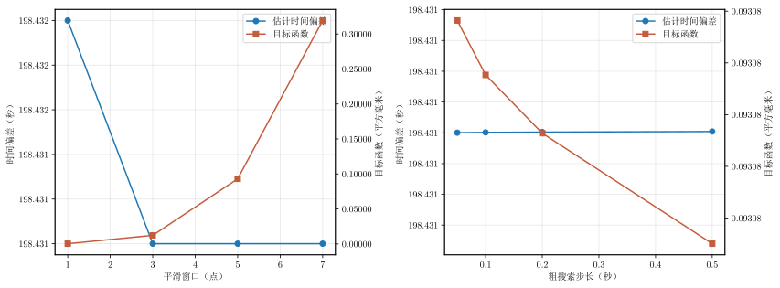

# 问题一敏感性分析

## 1. 分析目的

问题一的任务是利用方式 1 和方式 2 采集的二维轨迹数据，估计两台设备之间的时间偏差。敏感性分析用于回答一个问题：当平滑程度和搜索精度改变时，估计出来的时间偏差是否仍然稳定。

如果结果在合理参数范围内基本不变，说明时间偏差不是由某一个特定的算法参数“碰巧”得到的，模型具有较好的稳健性。

本分析使用当前仓库中的数据和求解逻辑。方式 1 和方式 2 的原始数据分别来自：

```text
inputs/table_1_sensor_1.csv
inputs/table_1_sensor_2.csv
```

## 2. 时间对齐模型

设方式 1 的轨迹为

\[
\mathbf p_1(t)=(x_1(t),y_1(t)),
\]

方式 2 的轨迹为

\[
\mathbf p_2(t)=(x_2(t),y_2(t)).
\]

用 \(\delta\) 表示方式 2 相对于方式 1 的时间偏差，则对齐后应满足

\[
\mathbf p_2(t+\delta)\approx\mathbf p_1(t)+\mathbf b,
\]

其中 \(\mathbf b=(b_x,b_y)\) 是可能存在的固定空间偏移。为了避免固定空间偏移影响时间估计，在每一个候选 \(\delta\) 下先计算

\[
d_{x,i}=x_2(t_i+\delta)-x_1(t_i),
\qquad
d_{y,i}=y_2(t_i+\delta)-y_1(t_i),
\]

再减去各自的平均值，构造目标函数

\[
J(\delta)=\frac{1}{N}\sum_{i=1}^{N}
\left[(d_{x,i}-\bar d_x)^2+(d_{y,i}-\bar d_y)^2\right].
\]

使 \(J(\delta)\) 最小的 \(\delta\) 即为估计的时间偏差。比较时间统一取 10 Hz 网格，缺少的坐标用线性插值获得。

## 3. 敏感性因素和实验设置

### 3.1 平滑窗口

对两个传感器的坐标分别进行居中的滑动平均：

\[
\tilde x_i=\frac{1}{w}\sum_{k=-r}^{r}x_{i+k},
\qquad w=2r+1.
\]

测试窗口为 1、3、5、7 个采样点。窗口 1 表示不平滑；窗口越大，平滑作用越强。平滑只用于检验参数敏感性，原始轨迹和时间戳没有被修改。

### 3.2 粗搜索步长

时间偏差先在较大范围内进行粗搜索，再在粗搜索最优点附近以 0.001 s 的细步长搜索。粗搜索步长分别设为：

```text
0.50 s、0.20 s、0.10 s、0.05 s
```

搜索区间为当前问题一求解器使用的 `[0, 1000] s`。

## 4. 结果

### 4.1 平滑窗口敏感性

| 平滑窗口（点） | 时间偏差（秒） | 目标函数（平方毫米） |
|---:|---:|---:|
| 1 | 198.432 | 0.00038 |
| 3 | 198.431 | 0.01228 |
| 5 | 198.431 | 0.09308 |
| 7 | 198.431 | 0.31924 |

平滑窗口从 1 点增加到 7 点时，时间偏差最大变化约 0.001 s。目标函数随着平滑窗口增大而上升，但这没有导致时间偏差发生有意义的变化。这里目标函数是轨迹形状残差，不是时间偏差本身；它变大说明过强平滑可能改变了局部轨迹形状，但时间定位仍然稳定。

### 4.2 粗搜索步长敏感性

| 粗搜索步长（秒） | 时间偏差（秒） | 目标函数（平方毫米） |
|---:|---:|---:|
| 0.50 | 198.431 | 0.09308 |
| 0.20 | 198.431 | 0.09308 |
| 0.10 | 198.431 | 0.09308 |
| 0.05 | 198.431 | 0.09308 |

粗搜索步长从 0.50 s 减小到 0.05 s，最终细搜索得到的时间偏差保持不变。这说明当前“粗搜 + 细搜”的计算精度已经足够，继续减小粗步长不会改变最终结论。

## 5. 图片解读

图片位于：

```text
outputs/one/problem_one_sensitivity.svg
```



图片左图横轴是平滑窗口，右图横轴是粗搜索步长。每个子图中：

- 蓝色圆点线表示估计时间偏差，对应左纵轴；
- 橙色方块线表示目标函数，对应右纵轴，单位为平方毫米。

蓝色曲线几乎是一条水平线，说明时间偏差对两个参数都不敏感。橙色曲线使用平方毫米和普通小数显示；左图中它随平滑窗口增加而升高，表示过强平滑会使轨迹形状残差变大；右图中变化极小，说明搜索步长主要影响计算过程，不影响最终时间估计。

## 6. 结论和论文表述建议

在测试的平滑窗口和粗搜索步长范围内，问题一估计的时间偏差稳定在约 `198.431 s`，最大变化小于 `0.001 s`。因此可以认为问题一的时间对齐结果对平滑参数和搜索步长具有较强稳健性。后续正文可采用 5 点平滑和 0.1 s 粗搜索步长作为默认设置，因为这组参数在计算量和结果稳定性之间较为平衡。

需要注意：该数值是按照当前仓库中的数据和代码得到的结果，应以当前版本为准。

## 7. 复现实验

```powershell
python -m solvers.one.sensitivity
python -m solvers.one.visual
```

敏感性数据写入 `outputs/one/sensitivity.csv`，图片写入 `outputs/one/problem_one_sensitivity.svg`。
