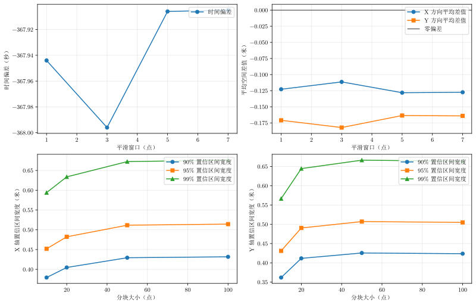

# 问题三敏感性分析

## 1. 分析目的

问题三使用附件三的实际测量数据，先完成问题二中的时间对齐和空间误差计算，再判断是否存在固定的系统偏差。由于实际测量误差可能随时间相关，不能只把所有逐点误差当成相互独立的数据。因此本敏感性分析重点考察：

- 平滑窗口改变时，时间偏差和平均空间差异是否稳定；
- 分块大小改变时，系统偏差检验是否稳定；
- 置信水平从 90% 提高到 99% 时，结论是否改变。

数据文件为：

```text
inputs/table_3_sensor_1.csv
inputs/table_3_sensor_2.csv
```

## 2. 时间对齐

设两台设备的轨迹为 $\mathbf p_1(t)$ 和 $\mathbf p_2(t)$，采用：

$$
\mathbf p_2(t+\delta)\approx\mathbf p_1(t).
$$

通过线性插值在共同的 10 Hz 时间网格上比较两条轨迹，并最小化去除平均空间偏移后的二维残差：

$$
J(\delta)=\frac{1}{N}\sum_i
\left[(d_{x,i}-\bar d_x)^2+(d_{y,i}-\bar d_y)^2\right].
$$

问题三允许正、负两个方向的时间偏差，搜索区间为 `[-1500, 1500] s`。本实现的符号约定是：

$$
\mathbf p_2(t+\delta)\approx\mathbf p_1(t).
$$

因此负值表示方式 2 的时间轴需要向后平移。最终估计约为 `-367.92 s`。

## 3. 固定系统偏差检验

时间对齐后得到逐点空间差异：

$$
d_{x,i}=x_2(t_i+\delta)-x_1(t_i),
\qquad
d_{y,i}=y_2(t_i+\delta)-y_1(t_i).
$$

### 3.1 分块

将误差序列按连续时间划分为大小为 $B$ 的完整数据块。由于轨迹是 10 Hz 采样：

| 分块大小（点） | 对应时间长度 |
| -------------: | -----------: |
|             10 |         1 秒 |
|             20 |         2 秒 |
|             50 |         5 秒 |
|            100 |        10 秒 |

第 $k$ 个块的均值为：

$$
\bar d_{x,k}=\frac{1}{B}\sum_{i\in k}d_{x,i},
\qquad
\bar d_{y,k}=\frac{1}{B}\sum_{i\in k}d_{y,i}.
$$

使用块均值而非全部逐点数据计算标准误，是为了减弱连续采样点之间相关性造成的“有效样本量虚高”问题。

### 3.2 置信区间和判据

设块均值共有 $K$ 个，块均值标准差为 $s_b$，则均值标准误为：

$$
\operatorname{SE}=\frac{s_b}{\sqrt K}.
$$

置信区间采用：

$$
\bar d\pm z_{\alpha/2}\operatorname{SE},
$$

其中 90%、95%、99% 置信水平对应的正态临界值分别约为 1.645、1.960、2.576。

判定规则为：

- 若置信区间包含 0，则没有足够证据认为存在固定系统偏差；
- 若置信区间完全大于 0 或完全小于 0，则判定存在相应轴的固定系统偏差。

## 4. 结果

### 4.1 平滑窗口敏感性

该组实验固定分块大小为 20 点、置信水平为 95%。

| 平滑窗口（点） | 时间偏差（秒） | 目标函数 | 平均 dx（米） | 平均 dy（米） |    X 轴置信区间 |    Y 轴置信区间 |
| -------------: | -------------: | -------: | ------------: | ------------: | --------------: | --------------: |
|              1 |       -367.920 |   34.743 |        -0.127 |        -0.166 | [-0.389, 0.135] | [-0.440, 0.108] |
|              3 |       -367.925 |   15.894 |        -0.126 |        -0.167 | [-0.388, 0.136] | [-0.441, 0.107] |
|              5 |       -367.922 |   10.042 |        -0.127 |        -0.167 | [-0.389, 0.136] | [-0.440, 0.107] |
|              7 |       -367.917 |    7.196 |        -0.127 |        -0.166 | [-0.390, 0.135] | [-0.439, 0.108] |

时间偏差变化范围约 0.008 s，平均 dx、平均 dy 也几乎不变。四组实验的 X、Y 置信区间都包含 0，因此平滑窗口改变不会改变“没有显著固定系统偏差”的判断。

### 4.2 分块大小和置信水平敏感性

以下表格列出 95% 置信水平下的区间。此组实验固定采用 5 点平滑，时间偏差为约 `-367.922 s`。

| 分块大小（点） | 块数 | X 轴 95% 区间（米） | Y 轴 95% 区间（米） |
| -------------: | ---: | ------------------: | ------------------: |
|             10 |  300 |     [-0.403, 0.150] |     [-0.432, 0.099] |
|             20 |  150 |     [-0.389, 0.136] |     [-0.440, 0.107] |
|             50 |   60 |     [-0.396, 0.143] |     [-0.428, 0.095] |
|            100 |   30 |     [-0.392, 0.139] |     [-0.419, 0.085] |

所有区间均包含 0。将置信水平提高到 99% 时，区间会变宽；降低到 90% 时，区间会变窄，但四种分块大小下的区间仍然包含 0。因此 90%、95%、99% 三种置信水平得出的系统偏差结论一致。

### 4.3 置信区间宽度的变化

图片中还绘制了不同置信水平下的区间宽度。对于同一分块大小，置信水平越高，区间越宽，这是统计置信度提高的正常结果。不同分块大小之间的区间宽度仅有小幅变化，没有出现某一种分块方式导致结论突然改变的情况。

## 5. 图片解读

图片位于：

```text
outputs/three/problem_three_sensitivity.svg
```



四个子图依次表示：

1. 平滑窗口对估计时间偏差的影响；
2. 平滑窗口对 X、Y 平均空间差异的影响；
3. 分块大小和置信水平对 X 轴置信区间宽度的影响；
4. 分块大小和置信水平对 Y 轴置信区间宽度的影响。

第一幅图的时间偏差曲线几乎水平，说明时间对齐稳定。第二幅图中平均 dx、平均 dy 始终接近固定的小负值，但这两个均值的不确定区间都跨过 0，不能据此认定存在系统偏差。第三、四幅图显示置信区间宽度随置信水平变化，但不同分块大小下变化规律相近。

## 6. 结论和论文表述建议

在平滑窗口 1--7 点、分块大小 10--100 点、置信水平 90%--99% 的测试范围内：

1. 时间偏差稳定在约 `-367.92 s`；
2. X 轴和 Y 轴的误差均值变化很小；
3. 所有系统偏差置信区间都包含 0；
4. 系统偏差检验结论不依赖于平滑窗口、分块大小和置信水平。

因此可以在问题三中报告：在采用分块均值进行相关性稳健检验后，没有发现 X 轴或 Y 轴存在显著固定系统空间偏差。后续融合时可以保留随机误差建模，而不必对 X、Y 轴施加固定偏移修正。推荐正文使用 5 点平滑、20 点分块和 95% 置信水平作为默认设置。

## 7. 复现实验

```powershell
python -m solvers.three.sensitivity
python -m solvers.three.visual
```

敏感性数据写入 `outputs/three/sensitivity.csv`，图片写入 `outputs/three/problem_three_sensitivity.svg`。
