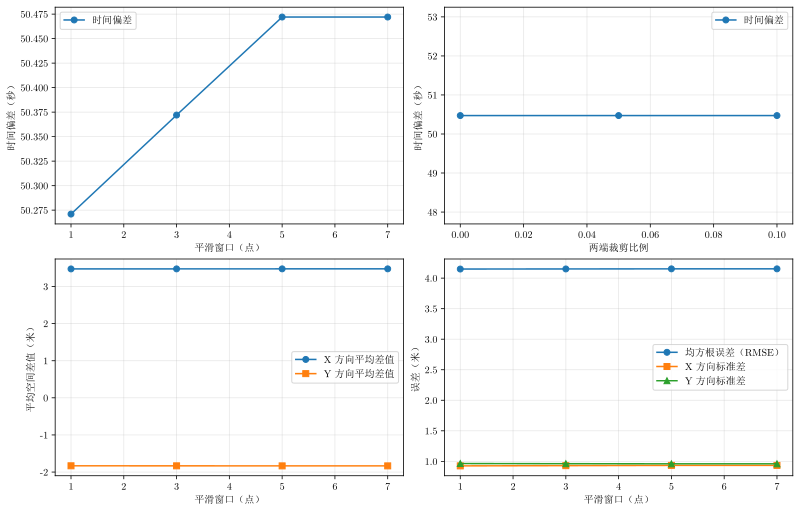

# 问题二敏感性分析

## 1. 分析目的

问题二在完成两类传感器数据的时间对齐后，还需要分析对齐后的空间差异。敏感性分析考察两个可能影响结果的因素：坐标平滑窗口，以及重叠时间区间两端是否裁剪。目标是确认估计时间偏差、平均空间差异和误差大小是否依赖某个具体参数。

本分析使用：

```text
inputs/table_2_sensor_1.csv
inputs/table_2_sensor_2.csv
```

## 2. 计算流程

### 2.1 数据预处理

对两个传感器的 X、Y 坐标分别进行居中滑动平均。窗口取 1、3、5、7 点，其中 1 点表示不平滑。平滑只用于估计时间偏差，不改变原始时间戳。

两条轨迹通过线性插值转换到共同的 10 Hz 比较时间网格。对于候选时间偏差 $\delta$，采用关系

$$
\mathbf p_2(t+\delta)\approx\mathbf p_1(t).
$$

时间偏差由最小化去除固定空间平均偏移后的二维残差得到：

$$
J(\delta)=\frac{1}{N}\sum_i
\left[(d_{x,i}-\bar d_x)^2+(d_{y,i}-\bar d_y)^2\right].
$$

问题二的时间搜索区间为 `[0, 1000] s`，使用粗搜索和细搜索相结合的方法。

### 2.2 空间指标

时间对齐后定义：

$$
d_{x,i}=x_2(t_i+\delta)-x_1(t_i),
\qquad
d_{y,i}=y_2(t_i+\delta)-y_1(t_i).
$$

计算以下指标：

平均空间差异：

$$
\bar d_x=\frac{1}{N}\sum_i d_{x,i},
\qquad
\bar d_y=\frac{1}{N}\sum_i d_{y,i};
$$

逐轴标准差：

$$
s_x=\operatorname{std}(d_x),
\qquad
s_y=\operatorname{std}(d_y);
$$

二维空间 RMSE：

$$
\operatorname{RMSE}=\sqrt{\frac{1}{N}\sum_i(d_{x,i}^2+d_{y,i}^2)}.
$$

### 2.3 重叠区间裁剪

首先使用 5 点平滑得到时间偏差，然后分别裁剪重叠区间两端的 0%、5% 和 10% 数据，只重新计算空间指标。该实验用于检查少量起始或结束边界数据是否过度影响平均误差。

## 3. 结果

### 3.1 平滑窗口敏感性

| 平滑窗口（点） | 时间偏差（秒） | 目标函数 | 平均 dx（米） | 平均 dy（米） | dx 标准差（米） | dy 标准差（米） | RMSE（米） |
| -------------: | -------------: | -------: | ------------: | ------------: | --------------: | --------------: | ---------: |
|              1 |         50.271 |    1.788 |         3.474 |        -1.832 |           0.926 |           0.965 |      4.148 |
|              3 |         50.372 |    0.802 |         3.474 |        -1.833 |           0.930 |           0.962 |      4.150 |
|              5 |         50.472 |    0.505 |         3.475 |        -1.834 |           0.934 |           0.960 |      4.151 |
|              7 |         50.472 |    0.370 |         3.475 |        -1.834 |           0.934 |           0.960 |      4.151 |

时间偏差随窗口增大最多变化约 0.201 s，空间平均差异变化小于 0.002 m，RMSE 变化约 0.003 m。目标函数明显下降，说明平滑降低了逐点波动；但空间 RMSE 几乎不变，说明这种降低没有改变总体空间误差水平。

### 3.2 重叠区间裁剪敏感性

此部分固定采用 5 点平滑和对应的 `50.472 s` 时间偏差。

| 两端裁剪比例 | 时间偏差（秒） | 平均 dx（米） | 平均 dy（米） | dx 标准差（米） | dy 标准差（米） | RMSE（米） |
| -----------: | -------------: | ------------: | ------------: | --------------: | --------------: | ---------: |
|           0% |         50.472 |         3.475 |        -1.834 |           0.934 |           0.960 |      4.151 |
|           5% |         50.472 |         3.495 |        -1.834 |           0.931 |           0.958 |      4.167 |
|          10% |         50.472 |         3.483 |        -1.829 |           0.927 |           0.964 |      4.156 |

裁剪比例不影响时间偏差。空间指标只有小幅波动，RMSE 始终约为 4.15 m，说明边界数据没有改变问题二的总体结论。

需要区分“平均空间差异”和“随机误差”：平均 dx 约为 `3.48 m`、平均 dy 约为 `-1.83 m`，反映两设备之间可能存在稳定的空间偏移；标准差和 RMSE 则反映对齐后剩余的波动大小。敏感性分析只是在不同参数下重复计算这些指标，不替代问题二本身对系统偏差和随机误差的估计。

## 4. 图片解读

图片位于：

```text
outputs/two/problem_two_sensitivity.svg
```



四个子图依次表示：

1. 平滑窗口对时间偏差的影响；
2. 两端裁剪比例对时间偏差的影响；
3. 平滑窗口对平均 dx、平均 dy 的影响；
4. 平滑窗口对 RMSE、dx 标准差、dy 标准差的影响。

第一幅图蓝色曲线只缓慢上升，说明平滑窗口对时间偏差的影响很小。第二幅图基本水平，说明裁剪重叠区间不会改变时间对齐结果。第三、四幅图中的曲线近似水平，说明空间偏移和总体误差对平滑窗口不敏感。

## 5. 结论和论文表述建议

在平滑窗口 1--7 点、重叠区间两端裁剪 0%--10% 的范围内，问题二的时间偏差约为 `50.3--50.5 s`，空间 RMSE 始终约为 `4.15 m`。因此时间对齐和空间误差估计具有较好的参数稳健性。正文可以采用 5 点滑动平均、保留全部重叠区间作为默认方案，并报告其时间偏差约 `50.472 s`、空间 RMSE 约 `4.151 m`。

## 6. 复现实验

```powershell
python -m solvers.two.sensitivity
python -m solvers.two.visual
```

敏感性数据写入 `outputs/two/sensitivity.csv`，图片写入 `outputs/two/problem_two_sensitivity.svg`。
